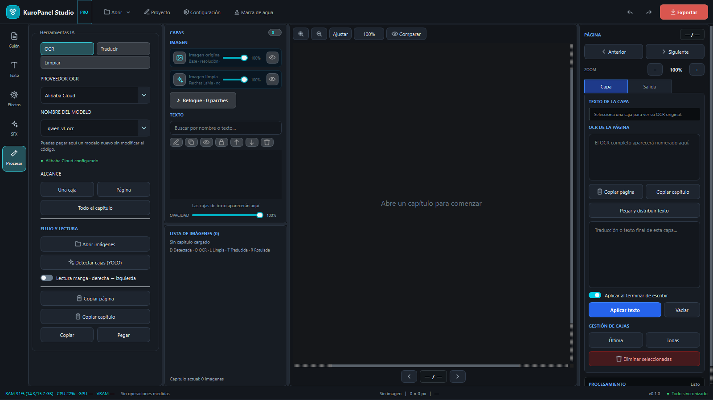
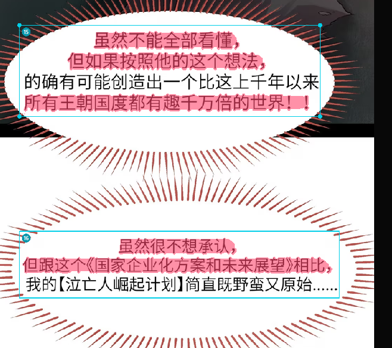
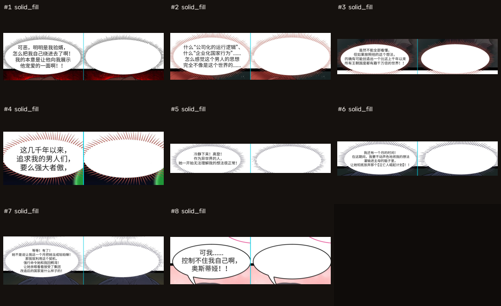
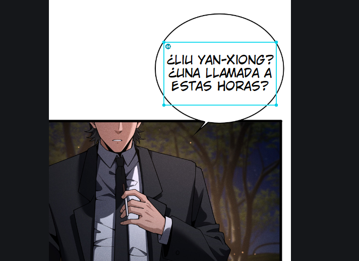
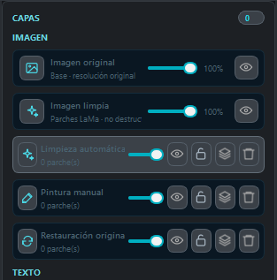

# KuroPanel Studio

Editor de escritorio para OCR, traducción, limpieza y typpeo de manhua, manhwa
y manga. Está construido con Python, PySide6, OpenCV y ONNX Runtime.

> [!WARNING]
> Este proyecto fue desarrollado en su mayoría con asistencia de inteligencia
> artificial, bajo dirección y pruebas humanas. Es software experimental y
> puede contener errores de funcionamiento, rendimiento, compatibilidad,
> seguridad o pérdida de trabajo. Conserva copias de las imágenes y proyectos
> originales, revisa siempre las máscaras y verifica cada exportación antes de
> usarla en producción.

KuroPanel Studio es un proyecto independiente. No está afiliado con otros
editores de manga/manhua ni con los proveedores de modelos o APIs compatibles.

## Capturas

### Interfaz principal



### Detección y cajas OCR

Las cajas numeradas mantienen el orden de lectura y permiten ejecutar OCR,
traducción, limpieza y typpeo por región, página o capítulo.



### Limpieza LaMa no destructiva

Comparación de varios globos antes y después del proceso. La máscara de texto y
los parches de limpieza se conservan separados de la imagen original.



### Typpeo y traducción



### Capas de retoque



Las imágenes mostradas son material de prueba. Antes de reutilizar capturas o
páginas en publicaciones públicas, confirma que tienes los derechos necesarios.

## Funciones principales

- Detección local de texto con YOLO para páginas largas.
- OCR por caja, página o capítulo mediante proveedores configurables.
- Traducción con glosarios y contexto por proyecto.
- Limpieza con máscara OCR y LaMa ONNX, con respaldo CPU o aceleración CUDA.
- Previsualización de máscara y corrección manual de falsos positivos.
- Pinceles de pintura, máscara y restauración del original.
- Capas no destructivas con visibilidad, opacidad y bloqueo independientes.
- Typpeo con perfiles de fuente, estilos, trazo, degradado y resplandor.
- Herramientas SFX con perspectiva, curvas y deformación.
- Orden de lectura occidental o manga de derecha a izquierda.
- Importación de PNG, JPEG, WebP, PSD y PSB.
- Proyectos persistentes `.mseproj`, autoguardado y copias incrementales.
- Exportación por página o capítulo a resolución original.
- Comparación antes/después con divisor arrastrable.
- Monitor de RAM, VRAM y tiempos de procesamiento.

## Requisitos

- Windows 10 u 11 de 64 bits.
- Python 3.11 o posterior para ejecutar desde el código fuente. La versión de
  desarrollo actual se prueba con Python 3.14.
- 8 GB de RAM como mínimo; 16 GB o más son recomendables para tiras largas.
- Aproximadamente 4 GB libres para entorno, modelos y cachés.
- GPU NVIDIA opcional. El modo CPU continúa disponible sin CUDA.
- Git LFS para descargar los modelos almacenados en el repositorio.

## Instalación en Windows con el instalador `.exe` (recomendada)

Si solo quieres utilizar KuroPanel Studio, no necesitas instalar Python, Git ni
descargar el código fuente:

1. Abre la sección de [Releases](https://github.com/JipsonDev/KuroPanelStudio/releases).
2. En la versión más reciente, descarga
   `KuroPanelStudio-Setup-0.1.0-Windows-x64.exe`.
3. Ejecuta el instalador y, si lo deseas, activa el acceso directo del
   escritorio.
4. Abre **KuroPanel Studio** desde el menú Inicio o desde el acceso directo.

El instalador funciona en Windows x64, se instala en la carpeta del usuario y
no necesita permisos de administrador. Incluye la aplicación, los modelos y las
dependencias de ejecución. Las credenciales de las API no están incluidas: cada
usuario debe configurarlas dentro del programa.

Windows puede mostrar una advertencia de SmartScreen porque esta versión aún
no tiene firma digital. Verifica la descarga comparando su SHA-256 con el
archivo `SHA256SUMS.txt` incluido en la misma Release.

## Instalación desde el código fuente

Instala Git LFS antes de clonar, porque los modelos ONNX no caben en el flujo
normal de Git:

```powershell
git lfs install
git clone URL_DEL_REPOSITORIO
cd KuroPanelStudio
git lfs pull

py -3.14 -m venv .venv
.\.venv\Scripts\Activate.ps1
python -m pip install --upgrade pip
pip install -r requirements.txt
python main.py
```

Para NVIDIA, usa un entorno limpio e instala la variante GPU:

```powershell
py -3.14 -m venv .venv-gpu
.\.venv-gpu\Scripts\Activate.ps1
python -m pip install --upgrade pip
pip install -r requirements-gpu.txt
python main.py
```

La compatibilidad CUDA depende de que las versiones de ONNX Runtime, CUDA y
cuDNN sean compatibles entre sí. Si la inicialización CUDA falla, selecciona
CPU o Automático desde Configuración.

## Modelos

La carpeta `Models/` debe contener:

- `lama.onnx`: reconstrucción de las zonas enmascaradas.
- `ocr.onnx`: generación de la máscara local de texto para limpieza.
- `yolo12s_animetext.onnx`: detector de regiones de texto.
- `yolo12s_1class.yaml`: metadatos del detector.
- `yolo12s_animetext.pt`: respaldo opcional para desarrollo.

Los archivos `*.onnx`, `*.pt` y `*.safetensors` están configurados mediante
Git LFS en `.gitattributes`.

## Flujo recomendado

1. Abre una carpeta de imágenes, una imagen individual o un PSD/PSB.
2. Ejecuta **Detectar cajas (YOLO)** y corrige manualmente las regiones.
3. Configura el proveedor OCR y procesa una caja, la página o el capítulo.
4. Revisa la máscara antes de aplicar LaMa y elimina falsos positivos.
5. Traduce utilizando el glosario del proyecto.
6. Aplica perfiles tipográficos y corrige cada caja.
7. Compara original/resultado y exporta a resolución original.

## Credenciales y privacidad

Las claves de Alibaba, Gemini, DeepSeek y otros proveedores se introducen desde
Configuración. En Windows se guardan cifradas para el usuario actual mediante
DPAPI. `api_configs.json`, `credentials.dat`, entornos virtuales, compilaciones
y datos temporales no deben publicarse.

La aplicación puede enviar recortes de las cajas a las APIs elegidas por el
usuario. Revisa las políticas de privacidad de cada proveedor antes de procesar
contenido confidencial.

## Proyectos, capas y exportación

- Los archivos `.mseproj` guardan cajas, OCR, traducciones, estilos y parches.
- La imagen original se conserva como base de solo lectura.
- LaMa, pintura y restauración se almacenan como parches independientes.
- `Ctrl+S` guarda; `Ctrl+Z` deshace; `Ctrl+Y` o `Ctrl+Shift+Z` rehace.
- La exportación no incluye cajas, numerales ni controles del lienzo.

## Pruebas

```powershell
pip install pytest
python -m pytest -q
```

Las pruebas automatizadas reducen regresiones, pero no garantizan que todas las
páginas, fuentes, GPUs, idiomas o estilos de globo funcionen correctamente.
Reporta los fallos incluyendo sistema operativo, hardware, pasos y una muestra
que puedas compartir legalmente.

## Compilar para Windows

La edición completa GPU se construye con:

```powershell
.\build_windows.ps1
```

La edición compacta CPU-first se construye con:

```powershell
.\build_windows_compact.ps1
```

Para crear el instalador x64 con Inno Setup 6:

```powershell
.\build_installer.ps1 -Version 0.1.0
```

El instalador se genera en `github-release/KuroPanelStudio-v0.1.0/` y debe
adjuntarse como recurso binario de una GitHub Release, no como archivo normal
del repositorio.

## Estructura

```text
core/        lógica de OCR, detección, limpieza, proyectos y rendimiento
ui/          ventanas, paneles, lienzo y herramientas
scripts/     integración y utilidades para Photoshop/pruebas
tests/       pruebas automatizadas
Models/      modelos locales administrados con Git LFS
assets/      iconos, estilos y metadatos de Windows
docs/images/ capturas usadas por este README
installer/   configuración reproducible de Inno Setup
```

## Contribuciones

Se aceptan reportes y mejoras, pero revisa cuidadosamente el código generado o
modificado con IA. Una contribución debe explicar qué cambia, cómo fue probada
y qué riesgos conocidos conserva. No incluyas claves API, material con derechos
de terceros ni archivos personales.

## Licencia

La licencia pública todavía debe ser elegida por el propietario antes de abrir
el repositorio. Hasta que exista un archivo `LICENSE`, el código conserva los
derechos predeterminados de autor y no se concede automáticamente permiso para
redistribuirlo o modificarlo.
