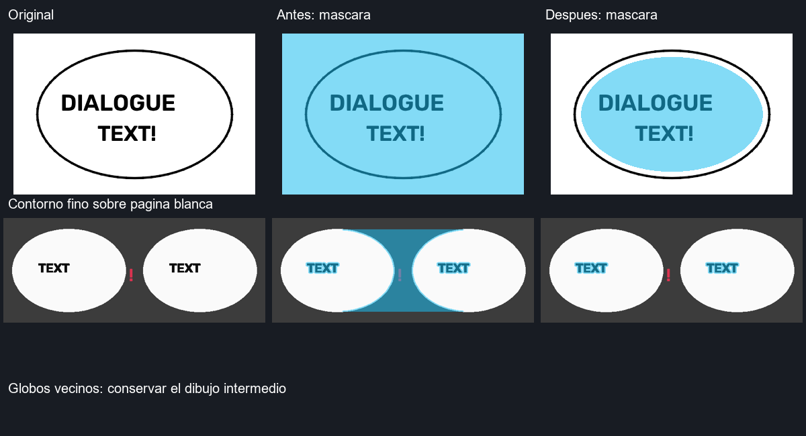

# Limpieza y detección de globos

## Correcciones

- Se identifica el interior de contornos cerrados antes de ajustar texto.
  Los bordes finos no se unen al fondo blanco de la página. Los huecos que
  dejan las letras se recuperan como espacio disponible para tipografía.
- Las líneas de texto con hasta 40 píxeles de separación vertical pueden
  agruparse cuando pertenecen al mismo globo cerrado. Dos contornos distintos
  impiden esa unión. Si falta evidencia del contorno, se conserva la regla
  anterior de proximidad de cinco píxeles.
- Una caja YOLO que ocupa más del 15 % de una imagen recortada puede conservarse
  si su texto está contenido en un globo. Antes se descartaba incondicionalmente.
- La máscara de limpieza reconstruye cada componente de fondo por separado
  y respeta su silueta, incluidas concavidades. Ya no forma un único contorno
  convexo que atraviesa el dibujo situado entre dos globos.
- Al combinar parches, solo se copian los píxeles incluidos en cada máscara.
  Un parche solapado ya no restaura accidentalmente el texto borrado por otro.
- La versión de caché de máscaras cambia para recalcular los resultados.

## Validación

Se añadieron 14 casos de regresión para contornos finos y pequeñas aperturas,
fondos blancos, coloreados y oscuros, cajas grandes, líneas espaciadas, globos
vecinos, siluetas cóncavas y parches solapados. Se prueba además el flujo completo
de preparación y limpieza de una página con dos globos.
La suite completa actual finaliza con **395 pruebas y 8 subtests aprobados**.

Comparación sintética contra el código original de `origin/main`
(`c82693de74ebd12e1172ae582abddf30a77a60fd`):

| Caso | Antes | Después |
| --- | ---: | ---: |
| Píxeles del área tipográfica fuera del globo de borde fino | 42 807 | 0 |
| Píxeles de limpieza fuera de dos globos vecinos | 17 631 | 0 |
| Píxeles de letras incluidos en la máscara de los globos vecinos | — | 100 % |
| Cajas conservadas en un globo recortado, YOLO ONNX real en CPU | 0 | 1 |



El cian representa el área tipográfica en la primera fila y la máscara que se
limpia en la segunda. La imagen de prueba se genera con formas y letras
sintéticas; no es una muestra de manga real ni una evaluación general de
precisión. Los pesos de YOLO, OCR y LaMa no se modificaron. La validación
posterior con cinco páginas aportadas por el usuario, siete globos anotados y
comparaciones visuales por globo se describe en
[validacion-limpieza-real.md](validacion-limpieza-real.md).

La validación con ONNX usa `Models/yolo12s_animetext.onnx` y ejecución CPU.
La limpieza entre globos se verifica con el relleno sólido real del programa;
esa muestra no necesita LaMa. Los contornos abiertos o muy degradados siguen
dependiendo de las heurísticas de respaldo y pueden requerir corrección manual.

```powershell
.\.venv\Scripts\python.exe -m pytest tests/test_balloon_cleaning.py -q
.\.venv\Scripts\python.exe -m pytest -q
```
