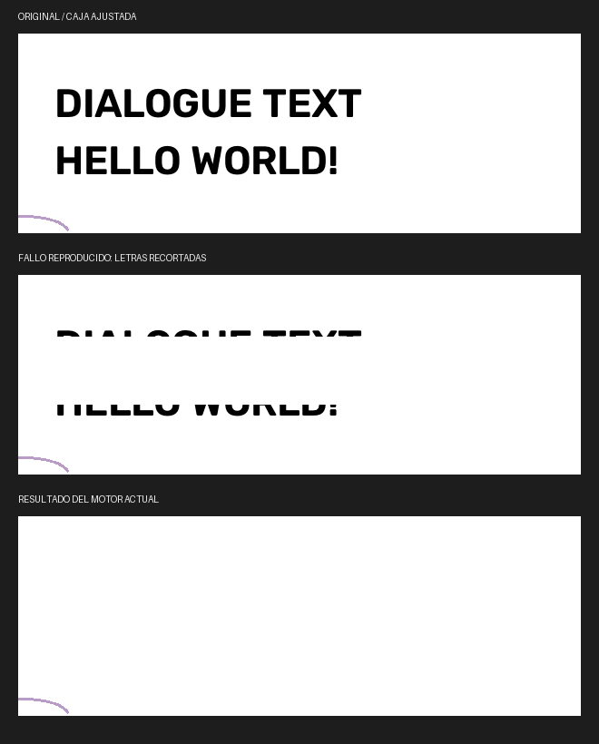

# Limpieza basada en regiones de color

Se inspeccionó el archivo `Bubble_Mask.atn` facilitado por el usuario sin ejecutar
acciones de Photoshop. Contiene una acción, `Make bubble mask`, con 19 pasos;
el lector consumió sus 2535 bytes. Los parámetros extraídos pueden generarse
localmente en `docs/bubble-mask-action.json`; ese informe no se publica.

La acción contrae la selección inicial 2 px, crea y rasteriza capas de relleno,
selecciona las altas luces invertidas, contrae dos veces 25 px, expande por color
con tolerancia 3 y antialiasing, invierte y aplica un desvanecimiento de 1 px.
También modifica máscaras y visibilidad. Su resultado depende de la selección
y las capas iniciales: no es un algoritmo independiente de limpieza de páginas.

La operación Grow de Photoshop selecciona píxeles adyacentes de color similar
dentro de una tolerancia. Esa es la idea adaptada al editor.
[Referencia de Adobe](https://helpx.adobe.com/uk/photoshop/desktop/make-selections/refine-modify-selections/expand-or-contract-selection.html).

## Cambios aplicados

- `core/bubble_mask.py` busca fondos uniformes conectados, con tolerancia 3,
  dentro de contornos cerrados. Reconstruye los huecos de las letras y los
  fragmentos pequeños cercanos. Conserva el color del fondo, incluso en globos
  grises, teñidos y oscuros.
- Valida un núcleo interior proporcional al tamaño en lugar de contraer siempre
  50 px, que eliminaría los globos pequeños. Protege el contorno y sus concavidades.
- Cubre las letras completas y su halo de suavizado antes del relleno; no aplica
  literalmente el desvanecimiento del ATN, que podría conservar bordes grises.
- `core/glyph_completion.py` completa trazos que cruzan los límites de una
  selección sobre fondo uniforme cuando se utiliza la ruta anterior.
- `core/cleaning_manager.py` conserva toda la máscara revisada al generar los
  parches. Antes podía recortarla nuevamente al rectángulo del detector, dejando
  extremos de letras sin borrar. La versión de caché de máscaras pasa a 38.
- Los globos uniformes aceptados se limpian localmente sin OCR remoto ni LaMa.
  Las regiones abiertas, degradadas o con textura siguen la ruta de máscara
  neuronal y reconstrucción existente.

No se ejecuta el ATN ni se reproduce Photoshop píxel por píxel. El algoritmo
rechaza regiones ambiguas; dibujos pequeños dentro de un globo pueden parecer
texto, por lo que se mantiene la revisión de máscara antes de limpiar una página.

## Comprobación

La suite completa pasó con **328 pruebas y 8 subpruebas**. Las nuevas pruebas
cubren cuatro combinaciones de fondo/tinta, tres escalas, fragmentos separados,
contornos cóncavos, rechazo de degradados/texturas y ejecución del relleno sin
invocar modelos neuronales. También verifican que los parches no recorten letras.

En una reproducción sintética del fallo mostrado por el usuario, ejecutada con
el modelo ONNX local incluido y el flujo real de limpieza, los píxeles oscuros
del texto pasaron de **9491 a 0**; el adorno cercano quedó intacto. La fila central
simula el fallo de recorte rectangular; no es una comparación contra Photoshop.
No se dispuso de la página original correspondiente a la captura del usuario.



Comandos reproducibles, sin llamadas a Alibaba:

```powershell
python -m pytest -q
python scripts/preview_cleaning_edges.py
python scripts/inspect_photoshop_action.py C:/ruta/a/Bubble_Mask.atn --output docs/bubble-mask-action.json
```

Para comprobarlo en el editor, vuelve a preparar la máscara sobre la página
original y revisa la cobertura antes de aplicar la limpieza.
