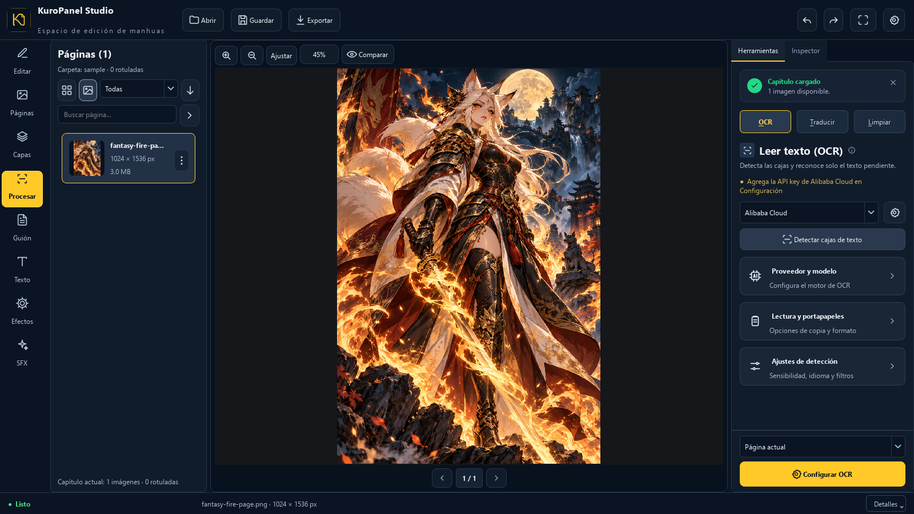
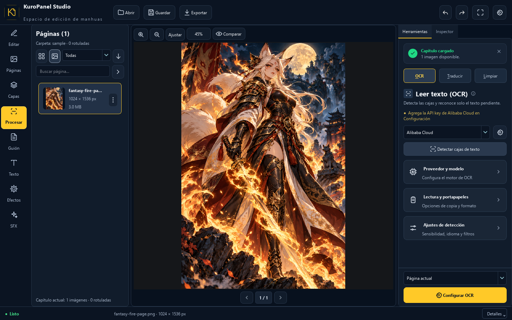
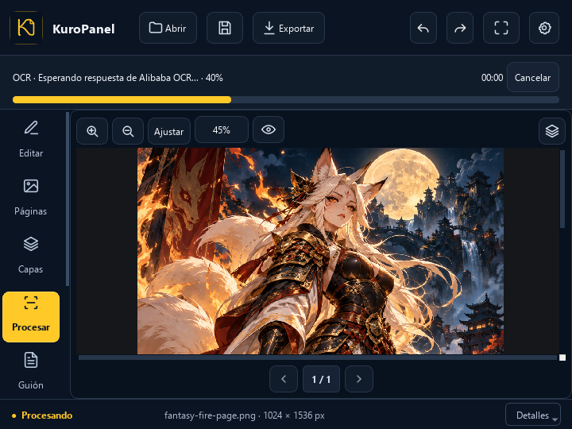
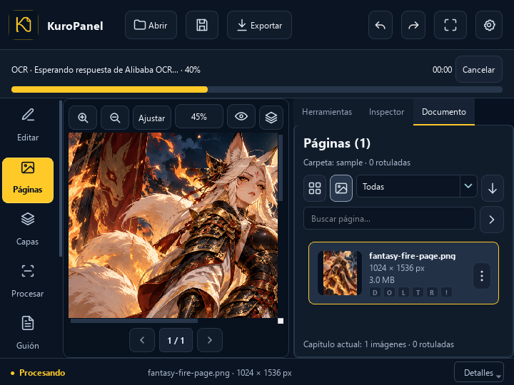
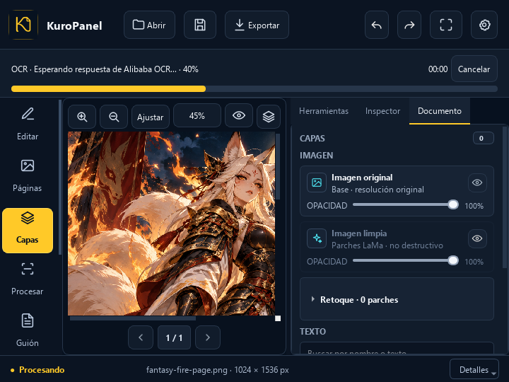
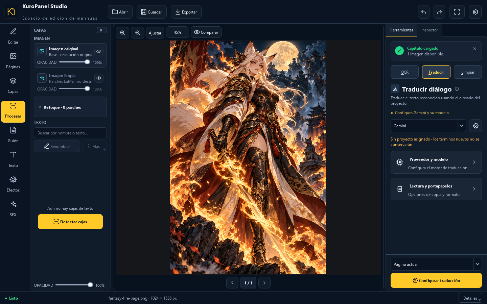
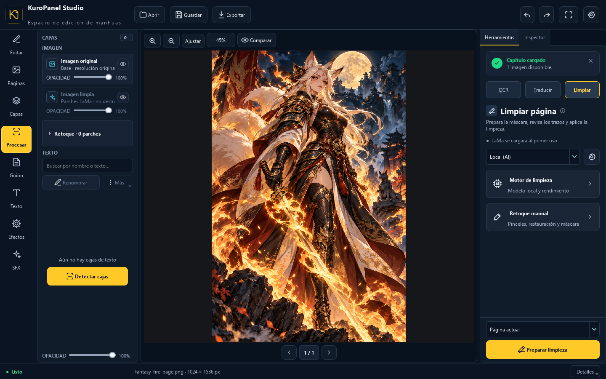

# Diseño y estructura del editor

El editor organiza el trabajo alrededor del lienzo. La referencia de esta
iteración usa azul marino oscuro, selección dorada y confirmaciones verdes.
Las capturas provienen de la ventana Qt real con una página de muestra original.



## Distribución

- Una barra lateral de ocho destinos permite pasar entre Editar, Páginas,
  Capas, Procesar, Guión, Texto, Efectos y SFX. **Páginas y Capas** comparten
  un panel a la izquierda; la segunda fila de pestañas se eliminó porque
  repetía esos accesos. **Editar** abre el Inspector; **Procesar** abre OCR,
  Traducir y Limpiar. La selección lateral sigue la pestaña o herramienta activa.
- Páginas ofrece miniaturas que se decodifican en segundo plano, vista de lista
  o cuadrícula, búsqueda, filtro por rotulación y orden inverso. La selección
  conserva el índice real del capítulo al invertir el orden.
- **Herramientas e Inspector** comparten pestañas a la derecha.
- OCR, Traducir y Limpiar mantienen la misma jerarquía: estado, proveedor,
  alcance, acción principal y tarjetas de ajustes. Cada tarjeta alinea icono,
  título y descripción; los tres modos permanecen visibles arriba.
- OCR, traducción y limpieza muestran un selector de alcance (globo, página o
  capítulo) y una acción principal fijos al pie del panel, accesibles incluso
  en ventanas bajas. Proveedores, modelos y retoque manual están en secciones
  plegables; los controles de revisión aparecen al preparar una máscara.
- La limpieza distingue «Preparar limpieza» para revisar una página o globo de
  «Limpiar capítulo», que ejecuta el procesamiento del capítulo directamente.
- Por debajo de 1180 píxeles de ancho, Páginas y Capas pasan a la pestaña
  **Documento** del panel derecho. Se conservan los mismos widgets y su estado.
- En esa distribución, el botón de panel del lienzo oculta o recupera el panel
  derecho. Al seleccionar Páginas, Capas o Procesar desde la barra lateral, el
  panel vuelve a abrirse. Esto permite revisar páginas pequeñas con un lienzo
  más ancho sin activar el modo de enfoque completo.
- En ventanas bajas la barra lateral conserva icono y nombre en cada destino;
  se desplaza verticalmente para alcanzar los ocho sin superponerlos.
- Capas usa desplazamiento vertical en ventanas bajas. La opacidad individual
  ocupa una segunda línea dentro de cada capa y sigue siendo editable. La
  acción **Renombrar** permanece visible y **Más** agrupa duplicar, mostrar,
  bloquear, ordenar y eliminar con nombres claros. Sin cajas de texto, el panel
  ofrece **Detectar cajas** en cuanto hay una página abierta.
- Los nombres largos de página se acortan visualmente, conservando el nombre
  completo en la descripción emergente. Los estados secundarios se ocultan si
  la fila no tiene ancho suficiente. El panel puede reducirse a 220 píxeles sin
  que el pie o el filtro obliguen a recortar las miniaturas.
- Las tareas largas muestran una barra de progreso real con operación, porcentaje,
  página y etapa, tiempo y resultado o error. **Cancelar** detiene la tarea
  cuando esta comprueba la señal de cancelación; los resultados cancelados no
  se aplican al proyecto.
- Páginas puede filtrar por detección, OCR, traducción, limpieza y errores.
  **Siguiente pendiente** (`Ctrl+Alt+N`) avanza en orden del capítulo incluso
  cuando la vista de miniaturas está invertida.
- La barra inferior muestra actividad y página; el botón **Detalles** ofrece
  RAM, CPU, GPU y tiempos de operación sin llenar el pie de cifras.
- **Enfoque** oculta los paneles auxiliares para ampliar el lienzo. Se activa
  desde la barra superior o con `Ctrl+Shift+F`; al salir recupera la distribución.
- La barra superior mantiene Abrir, Guardar, historial, Exportar y el menú de
  configuración. En ventanas pequeñas algunas acciones muestran solo su icono,
  con nombre accesible y descripción emergente.
- La bienvenida permite abrir un capítulo o un PSD/PSB y aceptar rutas locales
  arrastradas al editor.













## Organización del código

| Archivo | Responsabilidad |
| --- | --- |
| `ui/workspace.py` | Distribución adaptable, paneles y modo de enfoque. |
| `ui/welcome_panel.py` | Bienvenida, acciones de apertura y recepción de rutas. |
| `ui/topbar.py` | Acciones principales y adaptación de la cabecera. |
| `ui/main_window.py` | Conexión de las acciones con las operaciones del editor. |
| `ui/canvas_view.py` | Lienzo y cambio entre bienvenida y página cargada. |
| `ui/images_panel.py` | Navegación de páginas y miniaturas asíncronas. |
| `ui/layers_panel.py` | Filas de capas y opacidad con distribución adaptable. |
| `ui/ai_panel.py` | Herramientas OCR y de limpieza con ajustes plegables. |
| `ui/task_progress.py` | Progreso de tareas y errores visibles. |
| `assets/styles/dark_theme.qss` | Paleta, espaciado y estados visuales compartidos. |

La hoja de estilos sustituye las sucesivas sobreescrituras de colores por reglas
agrupadas para controles, paneles, capas, mensajes y bienvenida.

## Verificación

La suite completa pasó con **383 pruebas y 8 subpruebas**. Las pruebas de
`tests/test_workspace_layout.py` verifican cambios de distribución sin pérdida
de estado, cierre y apertura del panel, restauración del modo de enfoque, acciones de la cabecera y transición
entre bienvenida y página cargada.
`tests/test_uncluttered_workflow.py` comprueba las opciones plegables, el estado
de revisión, el acceso al retoque y la etiqueta de limpieza por capítulo.

Se renderizó la ventana Qt con el backend `offscreen` a 1440×900, 1024×768,
800×640 y 720×540, además de 1600×900 y los estados de edición, inspector,
progreso y enfoque. También se comprobó la vista compacta con factores de
escala Qt de 125 % y 150 %. Estas capturas comprueban la distribución; no
sustituyen una comprobación interactiva en una pantalla física. Al terminar la suite persisten
cuatro mensajes de Qt sobre un slot de `CanvasView`, también presentes en la
versión base, sin fallos de pruebas.

Para reproducir las capturas con ajustes temporales y sin llamadas a una API:

```powershell
python scripts/preview_workspace.py
```

Las imágenes se guardan en `graphify-out/ui-preview/`. La página de ejemplo
se incluye en `assets/sample/`; el script no utiliza documentos personales ni
servicios OCR externos.

## Arte de muestra

Las dos imágenes se crearon con la herramienta ImageGen integrada y se guardan
en `assets/sample/fantasy-fire-page.png` y `assets/sample/kuro-logo.png`.
Se usan solo para demostrar el editor; las funciones no dependen de una API de
imágenes durante la ejecución.

Prompt de la página: “Use case: illustration-story. Asset type: bundled demonstration page for the KuroPanel Studio desktop editor, vertical manhua page. Create an original fantasy character, an armored fox-spirit warrior with an elegant flowing cloak, surrounded by vivid orange and gold fire against deep midnight blue shadows. Dynamic clean ink lines, rich polished comic coloring, dramatic but readable silhouette. Tall portrait composition with subject centered, no panels, no speech balloons, no text, no watermarks, no software UI. This must be an original character distinct from any existing franchise. High detail suitable for a professional editing-app sample page.”

Prompt del logo: “Use case: logo-brand. Asset type: small square app logo for KuroPanel Studio desktop software. Minimalist original monogram inspired by a flowing calligraphic K and a comic panel corner, one continuous clean golden yellow #FFC928 outline with uniform medium weight and softly rounded ends, centered in a dark navy square #07111F. High contrast, readable at 32 pixels, no surrounding words, no other text, no gradient, no glow, no 3D, no decorative border. Flat front view. Icon graphic only.”
