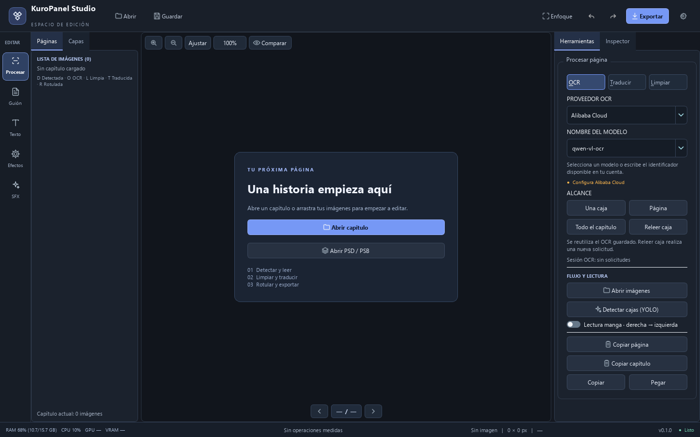

# Reducir el consumo de Alibaba OCR

## Por qué se repetían los cargos

Las acciones Página y Una caja forzaban solicitudes nuevas aun cuando el texto
ya estaba reconocido. Además, las respuestas vacías podían generar un segundo
intento automático y la caché se perdía al cerrar el editor. Una interrupción de
red también podía repetir un POST cuyo procesamiento ya hubiera comenzado.

Alibaba calcula el consumo a partir de los tokens de entrada y salida; las
imágenes también aportan tokens. La resolución de entrada y el texto enviado
influyen en ese consumo. Véase la [documentación de Qwen OCR](https://www.alibabacloud.com/help/en/model-studio/qwen-vl-ocr).

## Comportamiento actual

- **Una caja, Página y Todo el capítulo:** procesan únicamente cajas pendientes
  o modificadas. No vuelven a solicitar lecturas ya guardadas, incluso si el
  resultado revisado era vacío.
- **Releer caja:** realiza una nueva solicitud para la selección, con mejora
  local de contraste. Sirve para intentar recuperar una lectura incorrecta;
  su ayuda indica que consume una nueva solicitud.
- **Caché persistente:** hasta 10 000 lecturas en
  `%LOCALAPPDATA%/ManhuaSuiteEditor/Cache/ocr.sqlite3`. Guarda texto y claves
  hash, sin imágenes ni credenciales. Se comprueban archivo, geometría, modelo,
  servidor, estado de capas y perfil de calidad para reutilizar resultados.
- Las cajas con coordenadas idénticas comparten una solicitud, manteniendo sus
  identificadores independientes. Los resultados completados se guardan aunque
  otra llamada falle o se cancele la operación.
- No se repiten automáticamente respuestas vacías ni solicitudes interrumpidas.
  El usuario puede ejecutar de nuevo lo pendiente cuando haya revisado el fallo.
- El prompt es más corto. Se conservan los límites de resolución y los recortes
  individuales para no intercambiar diálogos entre globos.
- El panel muestra solicitudes y tokens de entrada/salida reportados durante la
  sesión. No estima dinero ni confunde datos de consumo ausentes con gasto cero.
  El contador se reinicia al cerrar el editor; no es la factura de Alibaba.



## Verificación sin gastar créditos

Los proveedores simulados cuentan cada solicitud saliente. Para 20 cajas sin
cambios, leídas tres veces:

| Escenario | Solicitudes |
| --- | ---: |
| Forzar las tres lecturas | 60 |
| Lectura inicial + repetir página + reiniciar el gestor con caché | 20 |

Eso representa **40 solicitudes evitadas (66,7%) en este caso concreto**, no una
promesa de ahorro universal en la factura. El primer OCR de una caja nueva sigue
utilizando el proveedor configurado.

La suite completa pasó con **299 pruebas y 8 subpruebas**. Trece casos nuevos
comprueban reutilización tras reinicio, invalidación al cambiar entradas,
duplicados, vacíos, relectura explícita, límites de caché, preservación de
resultados tardíos y contadores. No se realizaron llamadas reales a Alibaba
durante estas pruebas.

```powershell
python -m pytest tests/test_ocr_cost_control.py -q
```
