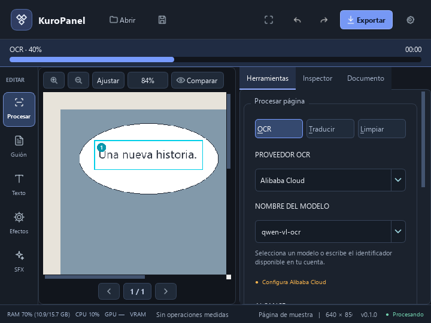

# Correcciones de OCR y progreso visible

## Fallos encontrados

El registro local contenía rechazos HTTP 400 con `min_pixels` mínimo de 4096 y
65536. El OCR enviaba siempre 3136, también al seleccionar modelos generales
de visión. Se eliminaron los parámetros opcionales `min_pixels` y `max_pixels`
de los mensajes: cada modelo aplica sus valores predeterminados. El recorte
local sigue limitado para evitar subir imágenes excesivas y ahora añade margen
a las selecciones que quedarían demasiado estrechas.

La [referencia oficial de Qwen OCR](https://www.alibabacloud.com/help/en/model-studio/qwen-vl-ocr-api-reference)
describe estos parámetros opcionales y las diferencias entre versiones.

## Configuración y diagnóstico

- **Configuración → OCR y traducción** permite editar el modelo y la URL base
  regional. Acepta la URL base o la ruta completa de chat/completions.
- La URL debe ser HTTPS de Alibaba; una ruta incorrecta se rechaza antes de
  enviar credenciales. No se cambia de región automáticamente.
- Se conserva el modelo exacto elegido, incluidas las versiones con fecha.
  Anteriormente se sustituía `qwen-vl-ocr-2025-11-20` al cargar los ajustes.
- Los errores 404 indican revisar modelo, región y espacio de trabajo. Incluyen
  el modelo solicitado y el servidor, sin mostrar la clave.
- Los errores de cuota, credenciales y conexión se distinguen. Un 404 no dispara
  reintentos de red. La caché se separa también por servidor.
- Antes de iniciar OCR se comprueban localmente la clave, el nombre de modelo y
  la URL. Si falta algo, la acción principal abre Configuración. Tras un 404,
  esa combinación de proveedor, modelo y URL se bloquea en la sesión hasta que
  cambie la configuración; así se evita repetir la solicitud fallida. El
  mensaje «modelo sin verificar» aclara que esta comprobación no consulta la
  disponibilidad del modelo en Alibaba.

Las [direcciones regionales documentadas](https://www.alibabacloud.com/help/en/model-studio/qwen-vl-ocr)
deben corresponder a la región de la clave y a la disponibilidad del modelo.

## Progreso

Una barra sobre el área de trabajo muestra la operación, el porcentaje y el
tiempo transcurrido. Empieza animada mientras se cargan modelos o se espera la
primera respuesta. Permanece visible con cualquier pestaña y en modo enfoque.
Funciona para detección, OCR, traducción, limpieza, exportación y lectura de
capítulos. Los errores permanecen disponibles en **Ver detalle** hasta cerrar
el aviso o iniciar otra operación. Las señales atrasadas de una importación no
sobrescriben el progreso de una tarea posterior.

Las operaciones por capítulo informan la página y etapa en curso. **Cancelar**
detiene los siguientes pasos al llegar a un punto de cancelación y descarta el
resultado de la tarea; las llamadas remotas ya enviadas pueden tardar en
finalizar. El panel Páginas permite filtrar errores y pendientes para revisarlos.



## Verificación

- Suite completa actual: **383 pruebas y 8 subpruebas aprobadas**.
- 14 casos nuevos cubren límites por modelo, recortes estrechos, 404 sin
  reintentos, configuración regional, conservación de versiones, errores de
  cuota y progreso de trabajadores Qt reales con el Inspector oculto.
- Capturas Qt con espera, porcentaje y error, incluidas ventanas de 720×540.
- Comprobación remota con una imagen sintética que dice `KURO TEST 123`, usando
  el modelo configurado `qwen-vl-ocr`: Alibaba respondió **cuota gratuita
  agotada**. No se enviaron páginas personales ni se modificó la facturación.
  La prueba no pudo verificar una transcripción real mientras exista ese bloqueo.

Para volver a usar esa cuenta, hay que revisar la cuota y la opción de utilizar
solo el nivel gratuito en Model Studio. Las correcciones locales no amplían
cuotas ni habilitan facturación automáticamente.

```powershell
python -m pytest tests/test_ocr_errors_progress.py -q
python scripts/preview_workspace.py
```
