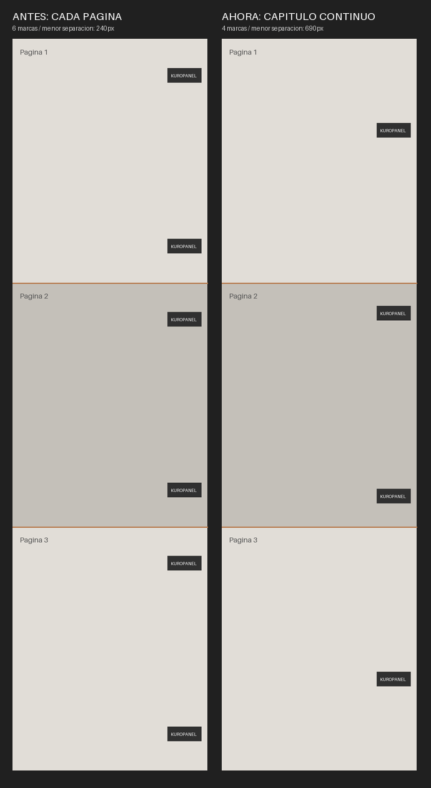

# Distribución de marcas de agua

El editor trata las páginas ordenadas como una tira continua: suma sus alturas,
calcula una sola distribución para el capítulo y convierte las coordenadas a
cada archivo. La separación mínima se mide entre los bordes de las marcas,
incluso cuando están en páginas distintas. No se carga una imagen gigante.

El reparto anterior reiniciaba la cantidad y los márgenes en cada página. La
protección local de las uniones no garantizaba la separación solicitada entre
archivos. Ahora solo hay márgenes exteriores del capítulo; las uniones impiden
que un logo se corte, pero no reinician la separación ni la alternancia.

## Uso

1. Abre **Configuración → Marca de agua** y selecciona un PNG.
2. Activa **Repartir por el capítulo completo**.
3. Elige **Columna alineada** o **Alternar izquierda y derecha**.
4. Ajusta la separación mínima, en píxeles de la página original, y la cantidad
   automática o manual **para el capítulo completo**. La columna usa la alineación de los ajustes avanzados;
   el modo alternado empieza en el lado seleccionado, o a la derecha si se centra.
5. Activa **Evitar cajas de texto detectadas** para proteger esas regiones.
   Se aplica también cuando hay una sola marca. Requiere cajas detectadas;
   no analiza automáticamente el dibujo ni ejecuta OCR.
6. Para corregir un proyecto con posiciones antiguas, pulsa **Redistribuir todo
   el capítulo** y **Todo el capítulo**. Esto reemplaza las posiciones manuales.
   **Redistribuir esta página** solo elimina las posiciones manuales de esa página;
   la vuelve a incorporar al cálculo global.

Si no hay espacio suficiente, se limita la cantidad por capacidad. Cada marca
conserva su zona del capítulo y solo se mueve dentro de un cuarto de su intervalo
normal. Si esa zona está bloqueada, se omite la marca sin trasladarla a otra página.
Una página completamente bloqueada puede quedar sin marcas. El estado muestra
la cantidad visible; los ajustes manuales pueden reducirla también.

Las posiciones manuales válidas se conservan hasta redistribuirlas; pueden
incumplir la separación entre sí. Si una página contiene posiciones duplicadas,
superpuestas o fuera de sus límites, se reconstruye su reparto automáticamente
al visualizar o exportar; no se modifica el archivo original del proyecto. El reparto automático reserva espacio alrededor de ellas.
Las páginas desactivadas siguen aportando su altura, pero no reciben marcas.
Sin repetición se mantiene la colocación individual anterior.

En la reproducción de tres páginas de 800 × 1000 px, cuatro marcas solicitadas
con separación mínima de 500 px producían antes seis marcas (dos por página)
y un hueco mínimo entre archivos de 240 px. El nuevo cálculo produce cuatro
marcas en total y un hueco mínimo de 690 px.



## Detalles y validación

- `core/chapter_watermarks.py` calcula el reparto global, las zonas libres por
  página y las coordenadas locales. Vista previa, exportación individual y
  exportación del capítulo usan el mismo plan.
- `core/watermark_layout.py` trabaja con intervalos libres y una pasada inversa
  que reserva espacio. No recorre píxeles ni utiliza servicios externos.
- `core/watermark_manager.py` limita la cantidad por capacidad, respeta la
  separación mínima y ajusta logos demasiado grandes o girados cuando está
  activado **Mantener dentro de la página**.
- El lienzo y la exportación utilizan las mismas coordenadas y límites verticales.
  Durante la carga, se usa la altura original de la escena, no la de la miniatura:
  esta última podía comprimir todas las marcas contra el borde inferior del
  recorte inicial, cerca del comienzo de la página larga.
- Un clic para seleccionar una marca ya no guarda toda la página como posiciones
  manuales; solo se guardan al desplazar una marca o eliminarla.
- Mover marcas manualmente y cambiar después la opacidad conserva sus posiciones.
- El panel usa la paleta oscura neutra; distribución es visible, tamaño/posición/
  apariencia están plegados y los botones de aplicación quedan fijos abajo.

Pasaron **367 pruebas y 8 subpruebas**, incluidas 26 regresiones del
reparto entre páginas y las 13 comprobaciones anteriores de
capacidad, regiones bloqueadas, alternancia, márgenes extremos, logos girados,
preservación de movimientos manuales y coincidencia entre lienzo y exportación.
Las ocho regresiones más recientes cubren miniaturas de páginas largas, zonas
bloqueadas, desplazamientos extremos, recuperación de posiciones inválidas y
selección sin guardar un reparto manual.
Persisten cuatro mensajes de Qt al cerrar sobre un slot de `CanvasView`, ya
presentes antes del cambio, sin fallos de pruebas.

```powershell
python -m pytest tests/test_chapter_watermarks.py tests/test_watermark_distribution.py -q
python scripts/preview_watermarks.py
python scripts/preview_chapter_watermarks.py
```

El script genera ejemplos sintéticos y una captura del diálogo Qt en
`graphify-out/ui-preview/`, sin cargar documentos del usuario ni llamar a APIs.
